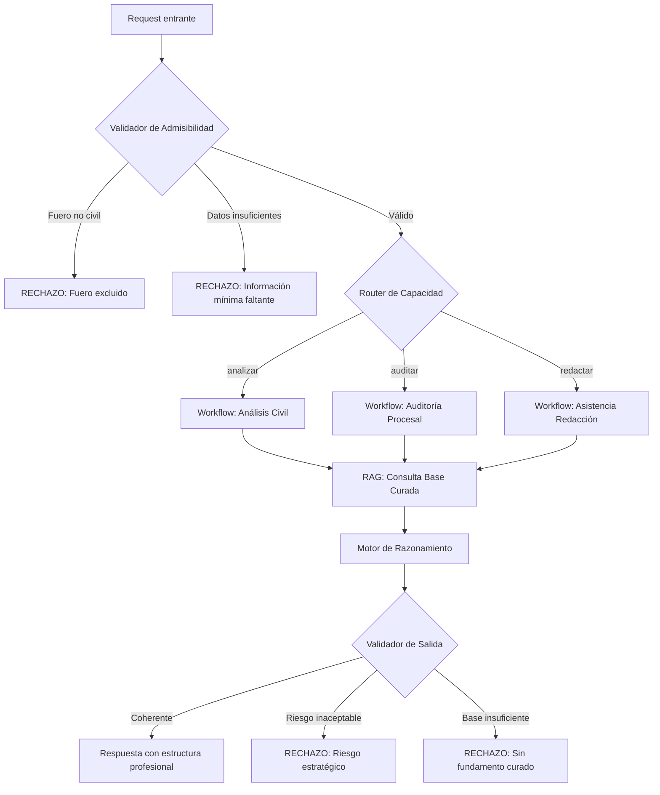

# Diseño de Workflows n8n – Alcance Legal Civil

## Reglas Inmutables

> [!CAUTION]
> Las siguientes reglas son **BLOQUEANTES** y no pueden omitirse bajo ningún escenario:

1. **Admisibilidad es GATE obligatorio** – Ningún request puede llegar a un workflow de capacidad sin pasar primero por el Validador de Admisibilidad. Si falla, el flujo termina con rechazo.

2. **Validación de tipo de solicitud** – El validador debe verificar que el tipo de solicitud (analizar/auditar/redactar) sea coherente con los datos proporcionados.

3. **RAG antes de generar** – Ningún workflow puede producir contenido sin consultar primero la base curada (metodología + jurisprudencia).

4. **Sin conclusiones fuera del RAG** – El motor NO puede generar conclusiones, recomendaciones ni afirmaciones que no estén fundamentadas en la base curada. Si no hay fundamento, debe rechazar.

5. **Validación de salida obligatoria** – Toda respuesta debe pasar por el validador de coherencia antes de entregarse.

6. **Rechazo es respuesta válida** – Un rechazo fundado no es un error, es una salida legítima del sistema.

7. **Redacción siempre es BORRADOR** – Todo output de asistencia en redacción debe rotularse como "borrador asistido" que requiere revisión del abogado.

---

## Arquitectura de Workflows



---

## Workflow 1: Validador de Admisibilidad

**Trigger**: Webhook desde API fachada

**Nodos**:
1. **Clasificador de Fuero** (AI)
   - Input: texto de consulta
   - Output: `{ fuero: "civil" | "penal" | "laboral" | ... }`
   
2. **Gate de Admisibilidad**
   - Si fuero ≠ "civil" → Rechazo inmediato con fundamentación
   - Si fuero = "civil" → Continúa

3. **Validador de Tipo de Solicitud**
   - Verifica coherencia entre capacidad solicitada y datos proporcionados
   - Ejemplo: no puede "redactar demanda" sin hechos ni pretensión
   - Si incoherente → Rechazo con sugerencia de reformulación

4. **Validador de Datos Mínimos**
   - Verifica que existan datos suficientes para procesar
   - Lista de campos requeridos según capacidad

5. **Router** → Envía al workflow correspondiente

---

## Workflow 2: Análisis Civil

**Input estructurado**:
```json
{
  "tipo_consulta": "contrato" | "daños" | "sucesión" | "ejecución" | "otro",
  "situacion_factica": "texto",
  "documentacion_disponible": ["lista"],
  "pretension_cliente": "texto",
  "jurisdiccion": "provincia"
}
```

**Secuencia**:
1. **RAG - Jurisprudencia** → Recupera casos similares de base curada
2. **RAG - Metodología** → Recupera criterios aplicables
3. **Análisis Estructurado** (AI con system prompt)
   - Aplica metodología recuperada
   - Identifica riesgos procesales
   - Evalúa viabilidad
4. **Validador de Coherencia** → Verifica que no contradiga guía rectora
5. **Formateador de Salida** → Estructura respuesta profesional

---

## Workflow 3: Auditoría Procesal

**Input estructurado**:
```json
{
  "etapa_procesal": "demanda" | "contestación" | "prueba" | "alegatos" | "sentencia",
  "estrategia_actual": "texto",
  "objetivo_procesal": "texto",
  "riesgos_identificados": ["lista"],
  "documentos_adjuntos": ["referencias"]
}
```

**Secuencia**:
1. **RAG - Metodología procesal**
2. **Detección de Supuestos Implícitos** → Identifica asunciones no explicitadas en la estrategia
3. **Evaluación de Consistencia** → Estrategia vs. Objetivo
4. **Identificación de Riesgos** → Según base curada
5. **Recomendaciones Fundamentadas**
6. **Advertencias Obligatorias** (incluye supuestos detectados)

---

## Workflow 4: Asistencia en Redacción

**Input estructurado**:
```json
{
  "tipo_escrito": "demanda" | "contestación" | "apelación" | "incidente" | "otro",
  "hechos_relevantes": "texto",
  "pretension": "texto",
  "fundamentos_juridicos": ["lista"],
  "modelo_base": "referencia_opcional"
}
```

**Secuencia**:
1. **RAG - Modelos de Escritos** → Recupera estructura base
2. **RAG - Jurisprudencia** → Citas aplicables
3. **Generación Guiada** → Siguiendo modelo + metodología
4. **Validación de Estilo** → Lenguaje profesional, sin coloquialismos
5. **Rotulado como BORRADOR ASISTIDO** → Header obligatorio en todo output
6. **Advertencias** → Secciones que requieren revisión del abogado

> [!WARNING]
> Todo output de este workflow DEBE incluir el rótulo:
> **"BORRADOR ASISTIDO – Requiere revisión y aprobación del abogado responsable"**

---

## Sistema de Rechazos

Cada rechazo devuelve:
```json
{
  "status": "rechazado",
  "tipo_rechazo": "fuero_excluido" | "datos_insuficientes" | "riesgo_inaceptable" | "sin_fundamento",
  "fundamentacion": "Explicación profesional del rechazo",
  "sugerencia": "Qué podría hacer el usuario para reformular"
}
```

Los rechazos son **primera clase** en el sistema, no errores.
